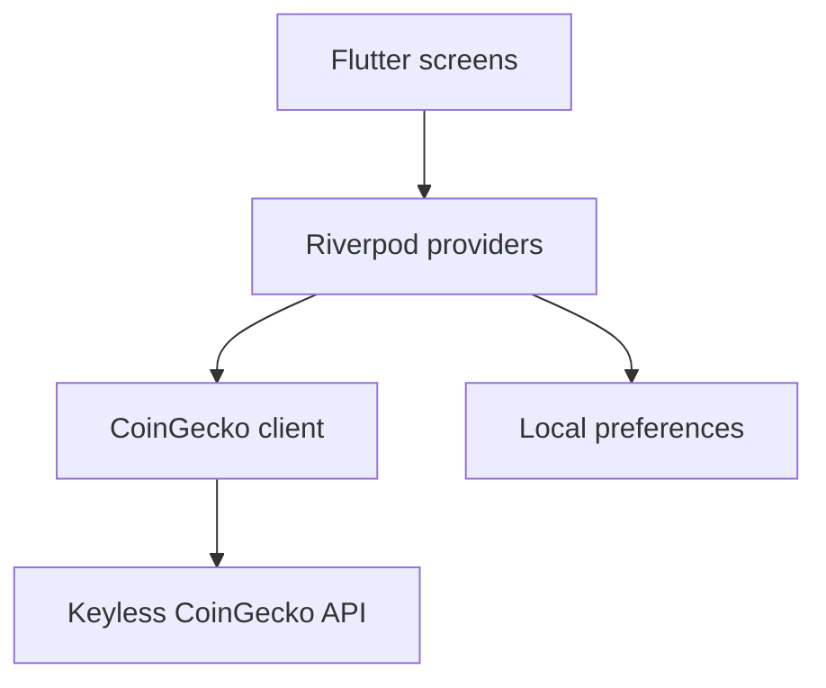

# CoinScope Flutter

A cross-platform Flutter companion to the [original CoinScope web app](https://coinscope-kappa.vercel.app/). It preserves the original product's dark slate surfaces, cyan-to-indigo identity, compact market cards, and clear gain/loss language while adapting the experience to Android, iOS, Windows, and the web.

[Open the Flutter web demo](https://coinscope-flutter.vercel.app/)

[Download the latest Android demo APK](https://github.com/mahfouzhsein/coinscope-flutter/releases/latest/download/CoinScope-Android.apk)

[Download the latest Windows demo ZIP](https://github.com/mahfouzhsein/coinscope-flutter/releases/latest/download/CoinScope-Windows.zip)

## What it includes

- Global market cap, 24-hour volume, Bitcoin dominance, and active coin metrics
- Trending assets and market-cap leaders
- Searchable, sortable, paginated markets in USD, EUR, or GBP
- Persistent currency, page-size, and watchlist preferences
- Coin detail views with 24H, 7D, 30D, 90D, and 1Y price charts
- Pull-to-refresh, loading skeletons, empty states, rate-limit messaging, and retry actions
- Cached remote coin imagery and accessible watchlist controls

No API key or secret is required. Market data comes directly from CoinGecko's public API, so public rate limits still apply.

## Architecture

The app uses feature-first folders with a small data/domain/presentation split. `flutter_riverpod` owns asynchronous market state and persisted preferences, `cached_network_image` handles coin artwork, and `shared_preferences` stores local choices.



## Run locally

Install the current stable Flutter SDK, select an Android device/emulator, iOS simulator, Windows desktop, or Chrome, then run:

```bash
flutter pub get
flutter run
```

Quality checks:

```bash
flutter analyze
flutter test
```

## Recruiter demo builds

Every push is checked by GitHub Actions, produces Android and Windows artifacts, and refreshes the installable `android-demo` release. Pushing a version tag such as `v1.0.0`, or manually running the **Publish versioned demo** workflow, creates a versioned GitHub Release with both builds.

The Flutter web build is also produced on every push. Its presentation is intentionally constrained to a centered 430-pixel phone canvas, with web-only Android and Windows download actions displayed below the app header.

Android may ask the reviewer to allow installation from the browser or file manager. iOS distribution requires Apple signing; TestFlight can be added later without changing the Flutter application architecture.

For Windows, extract the whole ZIP before opening `CoinScope.exe`; the adjacent DLL and `data` files are required by Flutter. The demo is not code-signed, so Windows SmartScreen may show an unrecognized-app warning.

## Platform identifiers

- Android application ID: `com.husseinmahfouz.coinscope`
- iOS bundle ID: `com.husseinmahfouz.coinscope`
- Windows executable: `CoinScope.exe`
- Web app: centered phone-width Flutter canvas

This project is independently maintained from the CoinScope web repository.
